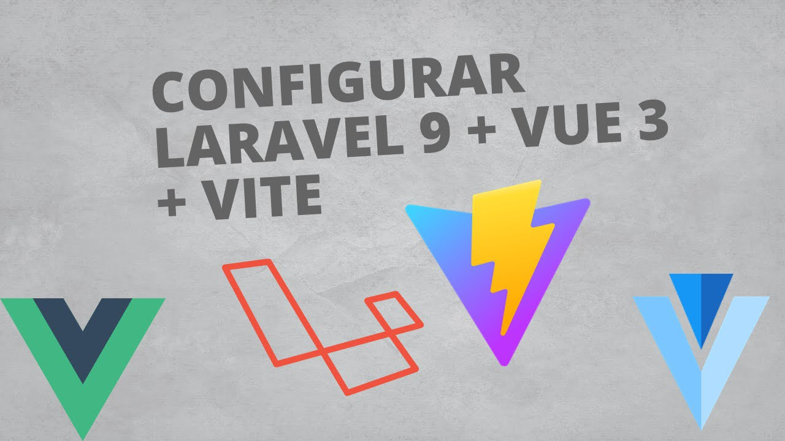

# Como instalar y Configurar | Vue 3 Router | Laravel 9 | Vite

[Versión web](http://josetello.co.pe/laravel-vue-installation)



## Configura Laravel 9 con Vue Router y vite en este articulo.

Aprende a instalar y configurar estos paquetes con las más recientes actualizaciones paso por paso.

## Paso numero 1: Instalar un proyecto Laravel

Si no tenemos ya instalado un proyecto Laravel, creamos uno nuevo con el siguiente comando.

```
composer create-project laravel/laravel project-name
```

## Paso numero 2: Instalamos Vue, Router y todos los paquetes necesarios con npm

```
npm install vue@next
npm install vue-loader@next
npm install @vitejs/plugin-vue
npm install vue-router --save
npm install vuetify@3.0.0-beta.10
npm install @mdi/font -D
npm install
npm run dev
```

## Paso numero 3: Configuramos el archivo vite.config.js

Necesitamos agregar algunas líneas de código en este archivo que se encuentra en el raiz de nuestro proyecto Laravel.

```
import vue from '@vitejs/plugin-vue';
vue(),
```

Quedaría de la siguiente manera:

```
import { defineConfig } from 'vite';
import laravel from 'laravel-vite-plugin';
import vue from '@vitejs/plugin-vue';

export default defineConfig({
   plugins: [
      vue(),
      laravel({
           input: ['resources/css/app.css', 'resources/js/app.js'],
            refresh: true,
      }),
   ],
});
```

## Paso numero 4: Creamos 4 carpetas en Resources/js/

- Componentes
- plugins
- router
- web

## Paso numero 5: En componentes creamos el archivo Navbar.vue

Y añadimos el código de la barra de navegación y un sidenav.

```
<template>
 <div>
  <v-card>
   <v-layout>
    <v-app-bar color="info">
     <v-app-bar-nav-icon
     @click.stop="drawer = !drawer">
    </v-app-bar-nav-icon>
   </v-app-bar>
   <v-navigation-drawer v-model="drawer" >
    <v-list >
     <v-list-item v-for="item in items" :to="item.ruta">
      {{item.nombre}}
     </v-list-item>
    </v-list>
   </v-navigation-drawer>
  </v-layout>
 </v-card>
</div>
</template>
<script>
 export default {
  data () {
   return {
    items: [
    { nombre: 'Inicio' , icon: 'Foo', ruta:'/' },
    { nombre: 'Contacto' , icon: 'Bar', ruta:'/contacto' }
    ],
    drawer: null,
   }
  },
 }
</script>
```

## Paso Numero 6: Creamos las rutas dentro del archivo router/index.js.

Creamos un archivo de nombre index.js dentro de router, con el que manejaremos as rutas del proyecto y añadimos el código.

```
import { createRouter, createWebHistory } from 'vue-router';

const HomeComponent = () => import ('../web/HomeCom.vue');
const ContactoComponent = () => import ('../web/ContactoCom.vue');

const routes=[
   { path:'/', name:'home', component:HomeComponent},
   { path:'/contacto', name:'contacto', component:ContactoComponent}
];

const router = createRouter({
   history: createWebHistory(import.meta.env.BASE_URL),
   routes
});

export default router;
```

## Paso numero 7: Creamos el archivo de entrada App.vue

Dentro de la carpeta web nos creamos un archivo de nombre App.vue el cual será el punto de entrada de nuestro proyecto, en el cual agregaremos el navbar y el router outlet para acceder a nuestras rutas, quedando de la siguiente manera:

```
<template>
    <div>
        <Navbar></Navbar>
        <router-view></router-view>
    </div>
</template>
<style>
   @import url('https://fonts.googleapis.com/css2?family=Roboto:wght@900&display=swap');
   #app {
      font-family: 'Roboto', sans-serif;
      -webkit-font-smoothing: antialiased;
      -moz-osx-font-smoothing: grayscale;
      color: #2c3e50;
   }
   .portada{
      margin-top: 70px;
   }
</style>
```

## Paso numero 8: Creamos la vista contacto.

Creamos un archivo de nombre ContactoCom.vue dentro de la carpeta web el cual tendrá la siguiente información.

```
<template>
   <div class="portada">
      <span>
         Este es el Contacto
      </span>
   </div>
</template>
```

## Paso numero 9: Creamos el archivo HomeCom.vue dentro de web.

Este es el home el cual tendrá la información de la página principal:

```
<template>
   <div class="portada">
      Este es el home
   </div>
</template>
```

## Paso numero 10: Configurar nuestro archivo principal app.js

Este archivo es muy importante para nuestro proyecto el cual tendrá la información necesaria para poder usar Vue y las rutas además de mdi font, en este fichero agregamos lo siguiente.

```
import { createApp } from 'vue/dist/vue.esm-bundler';
import App from './web/App.vue';
import RouterWeb from './router/index'
import '@mdi/font/css/materialdesignicons.css'
import NavbarComponent from "@/Componentes/Navbar.vue";

const app = createApp(App);

app.use(RouterWeb);
app.component('Navbar', NavbarComponent);
app.mount('#app');
```

## Paso 11: modificar el archivo welcome.blade.php de Laravel

Este archivo es el punto de entrada de nuestro proyecto Laravel en el cual tenemos que agregar Vite y vue, quedando de la siguiente manera:

```
<!DOCTYPE html>
<html lang="{{ str_replace('_', '-', app()->getLocale()) }}">
    <head>
        <meta charset="utf-8">
        <meta name="viewport" content="width=device-width, initial-scale=1">
        <title>Laravel</title>
        <!-- Fonts -->
        <link href="https://fonts.bunny.net/css2?family=Nunito:wght@400;600;700&display=swap" rel="stylesheet">
          @vite('resources/css/app.css')
    </head>
    <body>
        <div id="app"></div>
         @vite('resources/js/app.js')
    </body>
</html>
```

Y es todo, ahora solamente nos queda iniciar el server si no lo hemos iniciado con npm run serve y listo ya tenemos configurado nuestro proyecto Laravel + Vue 3 + Vite.